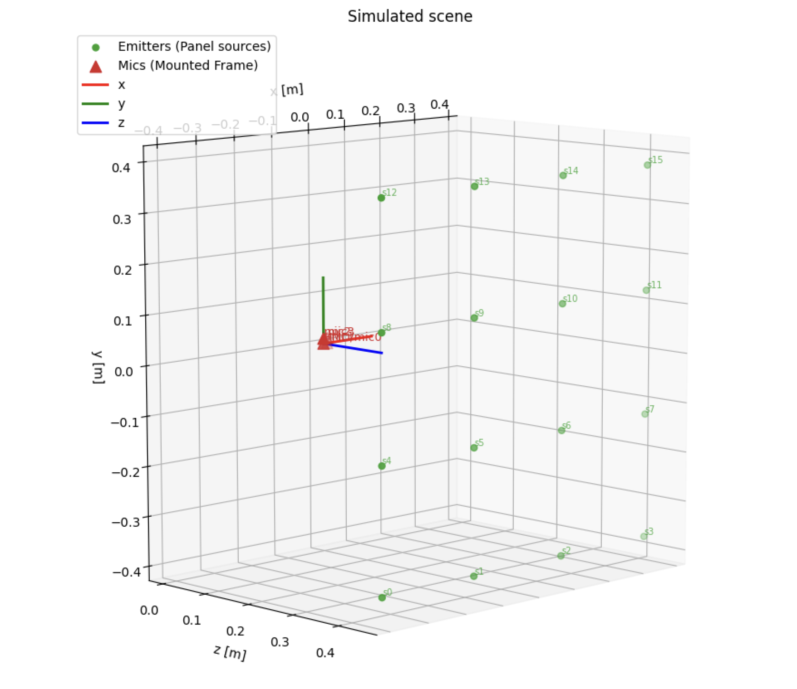
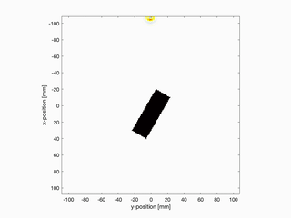
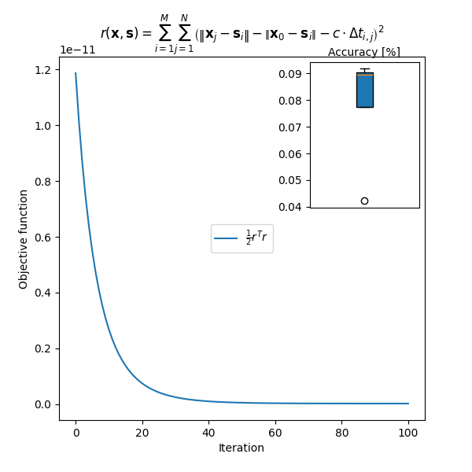

# Error propagation vs. initialization noise in TDOA microphone calibration

  
  
  

This repository studies **TDOA-based microphone calibration** and **source localization** under realistic acoustic conditions, with an emphasis on:

- nonlinear calibration error propagation,
- robustness to measurement noise,
- downstream localization accuracy,
- and physics-based simulation using **Python k-Wave**.

A key idea throughout is:

> Initialization noise affects **which solution** the nonlinear optimizer reaches.  
> Measurement noise affects the **local uncertainty** of the converged solution.

So even if the initial guess is close to the truth, the final calibration error can still be larger due to noise and geometry.

---

## 1. Measurement model (TDOA residual)

We estimate parameters:

$$
\boldsymbol{\theta}
$$

including:

- microphone positions $\mathbf{x}_0,\ldots,\mathbf{x}_{M-1}$  
- source positions $\mathbf{s}_i$  

(after removing gauge freedom).

For source $i$ and microphone $j \neq 0$, we define the forward model:

$$
h_{ij}(\boldsymbol{\theta}) =
\frac{\|\mathbf{x}_j - \mathbf{s}_i\| - \|\mathbf{x}_0 - \mathbf{s}_i\|}{c}
$$

Measured TDOA:

$$
\Delta t_{ij}^{\text{meas}} = \Delta t_{ij}^{\text{true}} + \epsilon_{ij}
$$

Residual:

$$
e_{ij}(\boldsymbol{\theta}) = 

h_{ij}(\boldsymbol{\theta}) - \Delta t_{ij}^{\text{meas}}
$$

Noise model:

$$
\mathbb{E}[\epsilon_{ij}] = 0, \quad
\mathrm{Var}(\epsilon_{ij}) = \sigma_{t,ij}^2
$$

---

## 2. Equivalent path-difference interpretation

We define:

$$
\delta d_{ij} = c\,\epsilon_{ij}
$$

so:

$$
\mathrm{Var}(\delta d_{ij}) = c^2 \sigma_{t,ij}^2
$$

Thus:

$$
\sigma_d = c\,\sigma_t
$$

This provides a direct scale for spatial error.

---

## 3. Initialization (starting guess)

We initialize:

$$
\hat{\boldsymbol{\theta}}^{(0)} =
\boldsymbol{\theta}^{\text{true}} + \boldsymbol{\eta}
$$

where $\boldsymbol{\eta}$ is the initialization error.

This affects:

- convergence basin,
- local minima selection,
- solver stability.

It does **not** define final estimation uncertainty.

---

## 4. Objective (weighted least squares)

We stack all residuals:

$$
\mathbf{e}(\boldsymbol{\theta})
$$

We minimize:

$$
F(\boldsymbol{\theta}) =
\frac{1}{2}\mathbf{e}^\top \mathbf{W}\mathbf{e}
$$

with:

$$
\mathbf{W} = \mathbf{\Sigma}^{-1}
$$

At convergence:

$$
\nabla F(\hat{\boldsymbol{\theta}}) \approx 0
$$

---

## 5. First-order error propagation

Linearize:

$$
\mathbf{e}(\boldsymbol{\theta}^{\text{true}} + \delta\boldsymbol{\theta})
\approx
\mathbf{J}\,\delta\boldsymbol{\theta} - \boldsymbol{\epsilon}
$$

where:

$$
\mathbf{J} =
\frac{\partial \mathbf{e}}{\partial \boldsymbol{\theta}}
$$

Gauss–Newton:

$$
\mathbf{J}^\top \mathbf{W} \mathbf{J}\,\delta\boldsymbol{\theta}
=
\mathbf{J}^\top \mathbf{W}\,\boldsymbol{\epsilon}
$$

Solution:

$$
\delta\boldsymbol{\theta}
=
(\mathbf{J}^\top \mathbf{W} \mathbf{J})^{-1}
\mathbf{J}^\top \mathbf{W}\,\boldsymbol{\epsilon}
$$

---

## 6. Covariance of the estimate

General form:

$$
\mathrm{Cov}(\delta\boldsymbol{\theta})
=
(\mathbf{J}^\top \mathbf{W} \mathbf{J})^{-1}
\mathbf{J}^\top \mathbf{W}
\mathbf{\Sigma}_\epsilon
\mathbf{W}\mathbf{J}
(\mathbf{J}^\top \mathbf{W} \mathbf{J})^{-1}
$$

If $\mathbf{W} = \mathbf{\Sigma}_\epsilon^{-1}$:

$$
\mathrm{Cov}(\delta\boldsymbol{\theta})
\approx
(\mathbf{J}^\top \mathbf{W} \mathbf{J})^{-1}
$$

---

## 7. Key result

At leading order:

- error is driven by **measurement noise**
- geometry enters via $\mathbf{J}$
- initialization $\boldsymbol{\eta}$ does **not** appear

There is no general bound:

$$
\|\hat{\boldsymbol{\theta}} - \boldsymbol{\theta}^{\text{true}}\|
\le
\|\boldsymbol{\eta}\|
$$

---

## 8. Order-of-magnitude intuition

$$
\sigma_d \sim c\,\sigma_t
$$

$$
\sigma_x \sim \kappa\,\sigma_d
$$

where $\kappa$ depends on geometry.

Thus:

$$
\kappa\sigma_d \gg \sigma_{\mathrm{init}}
\Rightarrow \text{final error exceeds initialization noise}
$$

---

## 9. Mic calibration vs source localization

We split:

### Calibration
Estimate $\mathbf{x}$ accurately.

### Localization
Estimate $\mathbf{s}$ using $\hat{\mathbf{x}}$.

Linearization:

$$
\mathbf{e}
\approx
\mathbf{J}_x \delta\mathbf{x}
+
\mathbf{J}_s \delta\mathbf{s}
-
\boldsymbol{\epsilon}
$$

Mic errors propagate into source estimates.

---

## 10. Cramér–Rao viewpoint

$$
\mathbf{F} = \mathbf{J}^\top \mathbf{W} \mathbf{J}
$$

$$
\mathrm{Cov} \approx \mathbf{F}^{+}
$$

Deviation from CRB indicates:

- nonlinearity
- local minima
- model mismatch

---

# Acoustic simulation (k-Wave)

In addition to analytical modeling, we simulate acoustic propagation using **Python k-Wave** :contentReference[oaicite:0]{index=0}.

---

## Rotating microphone array

We simulate a **rotating array** to improve robustness.

Benefits:

- increased geometric diversity  
- improved conditioning of $\mathbf{J}$  
- reduced ambiguity  
- robustness to NLOS  

Each rotation provides a new effective measurement geometry.

---

## Non-line-of-sight (NLOS) support

In NLOS:

- direct path may be blocked  
- TDOA becomes unreliable  

The rotating array helps because:

- different poses expose different propagation paths  
- some views recover usable information  

---

## PMMA slab model

The array is simulated together with a **PMMA slab** :contentReference[oaicite:1]{index=1}.

This introduces:

- reflections  
- transmission delays  
- structured propagation  

This makes the problem more realistic than free-field assumptions.

---

## k-Wave propagation simulation

We use k-Wave to simulate:

- full acoustic wave propagation  
- time-domain pressure fields  
- arrival signals at microphones  

The attached GIF (see repository) shows:

- wavefront propagation  
- interaction with the PMMA slab  
- signal arrival at the array  

This validates that:

- TDOA measurements arise from actual wave physics  
- not just ideal geometric assumptions  

---

